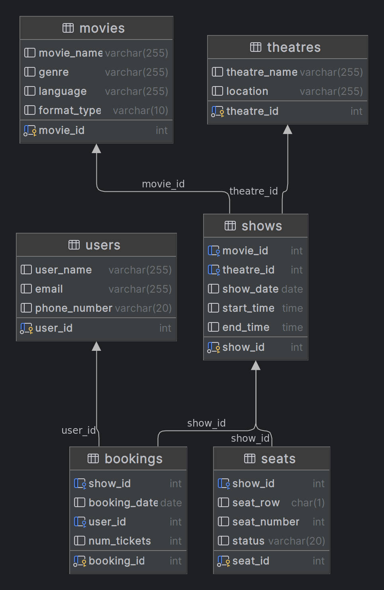

# Book My Show RESTful API

This project demonstrates the creation of a RESTful API that allows users to fetch shows from multiple theatres.

## Getting Started

To set up and run the project on your local machine, follow these steps:

1. **Clone the Repository:**

   ```bash
   git clone https://github.com/rajavarra/book-my-movie.git
   cd book-my-movie
   ```

2. **Install Dependencies:**
   ```bash
   npm install
   ```
3. **Start the Server:**
   ```bash
   npm start
   ```
   or, start dev with nodemon
   ```bash
   npm run dev
   ```
   The API will be accessible at http://localhost:8000/api/v1.

## Endpoints

- **GET /theatres:** Get all theatres.
- **GET /theatres/:id:** Get theatre details by Id.
- **GET /theatres/:id/shows:** Fetch all shows running in theatres with movie details.
- **GET /theatres/:id/shows/:showId:** Retrieve all details of seats for show with Id for theatre with theatreID.

## Data Storage

Sequel Data Store:


## Error Handling

The API includes proper error handling for invalid requests. Common HTTP status codes are used to indicate the result of each request:

- **200 OK**: Successful request.
- **201 Created**: Successfully created.
- **204 No Content**: Successfully deleted.
- **400 Bad Request**: Invalid request or validation error.
- **404 Not Found**: Resource not found.
- **500 Internal Server Error**: Server error.
